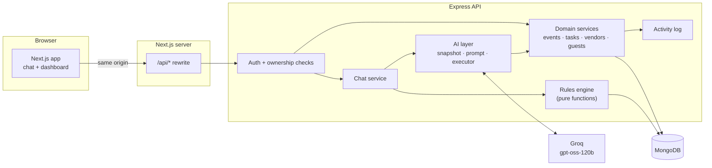
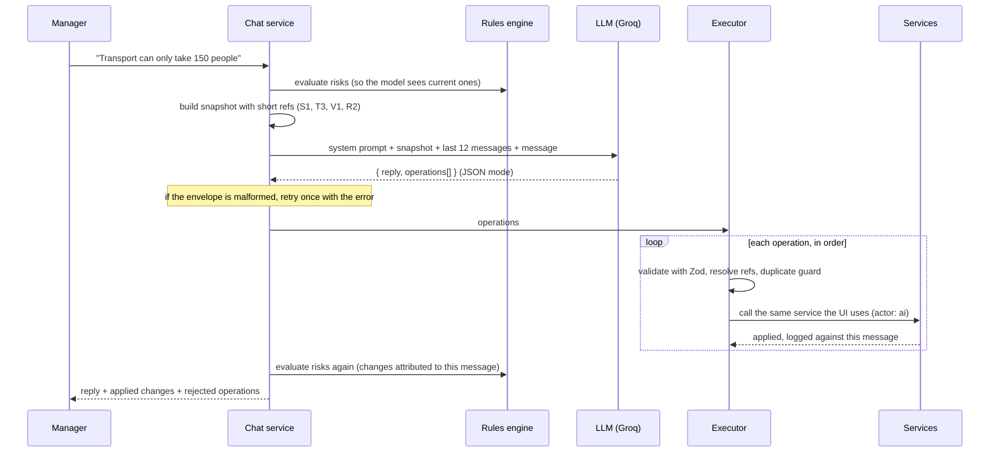

# The Xperience: AI Event Management Assistant

An event manager describes their event in plain language. The assistant turns each message into validated changes to a structured plan (sub-events, tasks, vendors and guest groups), a rules engine flags risks the moment they appear, and a live dashboard shows the whole picture.

**Live demo:** [event-management-assistance.netlify.app](https://event-management-assistance.netlify.app/login?next=%2Fevents) ·

**Stack:** Next.js 16 · Express 5 · MongoDB · TypeScript · Groq (gpt-oss-120b)

---

## Contents

1. [The problem and the approach](#the-problem-and-the-approach)
2. [How the brief's scenarios play out](#how-the-briefs-scenarios-play-out)
3. [Architecture](#architecture)
4. [How a chat message becomes changes](#how-a-chat-message-becomes-changes)
5. [Risk engine](#risk-engine)
6. [Key design decisions](#key-design-decisions)
7. [Data model](#data-model)
8. [Technology stack](#technology-stack)
9. [Local setup](#local-setup)
10. [Deployment](#deployment)
11. [API reference](#api-reference)
12. [Project structure](#project-structure)
13. [Assumptions](#assumptions)
14. [Known limitations and next steps](#known-limitations-and-next-steps)

---

## The problem and the approach

An event manager juggles conversations, vendors, guests, deadlines and constant last-minute changes. Most of that information arrives as sentences ("the photographer can't make the Reception"), but acting on it requires structure: which sub-event is affected, which tasks follow, what else breaks.

The core idea of this project is that **conversation is the input and structured state is the output**:

1. The manager talks to the assistant naturally.
2. The assistant proposes **typed operations** (`addTask`, `updateVendor`, `addSubEvent`, …), never free-form database writes.
3. The server **validates and applies** each operation through the same services the UI uses, recording every change in an activity log.
4. A **deterministic rules engine** re-checks the plan and raises, escalates or resolves risks.
5. The **dashboard** reflects the new state immediately, and each assistant reply shows exactly what it changed.

The assistant is useful because it is constrained: it can only express intentions the system understands, it can never delete anything, and every change it makes is visible and traceable.

### What the manager gets

- **A conversational planner** that creates sub-events, tasks with dependencies and due dates, vendors and guest groups from plain sentences, and updates them as plans change.
- **A change card under every reply** listing what was actually applied, plus any proposed change that was rejected and why.
- **Automatic risk detection**: capacity shortfalls, missing or dropped vendors, overdue and blocked tasks, impossible deadlines, guest needs nobody is handling. Risks escalate as the event approaches and resolve themselves when fixed.
- **Judgment risks from the AI** for things rules can't see, such as rain at an outdoor ceremony.
- **One-click fixes** on risks ("Add a task to replace the photography vendor").
- **A live dashboard**: overview, sub-event timeline, task board, vendors by category, risks, and a full activity feed showing who changed what (you, the assistant, or an automatic check).

---

## How the brief's scenarios play out

The wedding rows are behaviour observed while testing the chat end to end. The corporate rows combine rule output verified against a fixture of that scenario with how the assistant is instructed to handle each message.

### Wedding

| Manager says                                                                                                                            | What the system does                                                                                                                                                         |
| --------------------------------------------------------------------------------------------------------------------------------------- | ---------------------------------------------------------------------------------------------------------------------------------------------------------------------------- |
| "Three-day wedding for ~400 guests with a Sangeet, Haldi, Wedding Ceremony and Reception. We need venue, catering, décor, photography…" | Creates the four sub-events with dates and times, plus one task per requirement. The rules engine raises low-severity "No confirmed X vendor" risks for the essentials.      |
| "The Sangeet venue has been finalised, but we still need to confirm the décor vendor."                                                  | **Updates** the existing Sangeet instead of creating a duplicate, and adds a décor-confirmation task. It does not invent a venue name it wasn't given.                       |
| "Around 150 guests will be travelling from outside the city…"                                                                           | Reuses or creates the outstation guest group with `accommodation` and `airport_transfer` needs, and adds the corresponding tasks.                                            |
| "The catering team needs the final guest count one week before the wedding."                                                            | Resolves "one week before" against the event date (Dec 10 → Dec 3). When a matching task already exists with that date, it says so instead of creating a duplicate.          |
| "The photographer is unavailable for the Reception. Help me understand what needs to be addressed."                                     | Explains the impact, creates a replacement task **linked to the Reception**, and the coverage rule raises _No photography vendor for Reception_ (high) with a one-click fix. |

### Corporate outing

| Manager says                                                     | What the system does                                                                                                               |
| ---------------------------------------------------------------- | ---------------------------------------------------------------------------------------------------------------------------------- |
| "The resort has been confirmed for 200 people."                  | Confirms the venue vendor with capacity 200; venue-capacity check passes.                                                          |
| "Around 40 employees will be travelling from different cities."  | Adds a guest group with travel needs; flags it if no task or vendor covers accommodation.                                          |
| "We need to finalise the team-building activities by Friday."    | Resolves "Friday" using today's date and the weekday supplied in the context.                                                      |
| "The CEO will be joining only on the second day…"                | Schedules the leadership session on day 2 and can raise a judgment risk about the dependency on one person.                        |
| "The transport vendor can only provide vehicles for 150 people." | Updates capacity; the capacity rule raises _Transportation capacity short by 50_ with a fix that adds a task for the remaining 50. |

The same capacity rule behaves differently in each scenario, deliberately: in the wedding, transport is for the 150 outstation guests, so a 150-seat vendor is enough; in the corporate outing it is for all 200 employees. Demand comes from guest groups when they specify a need, and falls back to the event headcount otherwise.

---

## Architecture



- **npm workspaces monorepo** with three packages: `apps/web` (Next.js), `apps/api` (Express) and `packages/shared` (Zod schemas and TypeScript types used by both, and by the AI layer).
- **Same-origin proxy**: the browser only ever calls `/api/*` on the web app's own origin, which forwards it to Express (a Next.js rewrite locally, a Netlify edge proxy in production). This keeps the refresh-token cookie first-party and removes CORS from the picture entirely.
- **Layered API**: routes → controllers (HTTP only) → services (business rules, no HTTP) → Mongoose models. Both the HTTP controllers and the AI executor call the same services, so the assistant obeys exactly the same rules as the manager.

---

## How a chat message becomes changes



Key details:

- **The model is asked before anything is saved.** If Groq fails or returns unusable output twice, nothing is written and the manager can simply resend.
- **Each operation succeeds or fails on its own.** One malformed operation does not discard the rest of the turn; rejections are stored with a reason and shown under the reply.
- **The reply cannot lie.** The model writes its reply before execution, so if anything was rejected the server appends a note ("1 of 3 proposed changes could not be applied"). That note also enters the conversation history, so the model knows on the next turn.
- **Changes are read from the activity log**, not from what the model claimed. The assistant message's id is generated before execution so every change can point back to it.

A dry-run tool shows the snapshot and the model's proposed operations without changing anything:

```bash
npm run ai:preview -w @xperience/api -- <eventId> "The photographer is unavailable for the Reception"
```

---

## Risk engine

Risks come from two sources with a clear division of labour:

| Source                                    | Detects                                                                         | Lifecycle                                                                                                                    |
| ----------------------------------------- | ------------------------------------------------------------------------------- | ---------------------------------------------------------------------------------------------------------------------------- |
| **Rules** (deterministic, pure functions) | Anything objective and checkable                                                | Re-evaluated on every read and after every chat turn; raised, refreshed, escalated, auto-resolved and reopened automatically |
| **AI** (`addRisk` operation)              | Judgment calls rules can't see: weather, key-person dependency, budget pressure | Resolved by the assistant or the manager                                                                                     |

The prompt explicitly tells the model not to raise risks the rules already track, so the same problem is never listed twice.

### Rules

| Rule             | Raises when                                                                            | Suggested fix                             |
| ---------------- | -------------------------------------------------------------------------------------- | ----------------------------------------- |
| Capacity         | Confirmed capacity in venue, catering, transport or accommodation is below demand      | Task for the remaining people             |
| Missing vendor   | A needed category (essential for the event type, or has tasks) has no confirmed vendor | Task to shortlist one, if none exists     |
| Lost coverage    | A vendor assigned to a sub-event became unavailable and no confirmed vendor covers it  | Replacement task linked to that sub-event |
| Overdue tasks    | Open tasks are past their due date (one summary risk)                                  | —                                         |
| Dependency order | A task is due before a task it depends on                                              | Move its due date                         |
| Blocked tasks    | A task due within 7 days still waits on unfinished work                                | Raise the blocker's priority              |
| Guest needs      | A guest group needs something no task or confirmed vendor covers                       | Task for that need                        |

For gaps such as missing vendors, severity scales with how close the event is (≤14 days critical, ≤30 high, ≤60 medium), so risks escalate on their own as the date approaches, and each escalation is logged. Capacity shortfalls are rated by the size of the gap, and lost sub-event coverage is always at least high.

Every rule risk has a stable `ruleKey` (for example `capacity:transportation`). Evaluation reconciles what the rules find with what is stored, using a partial unique index to stay correct under concurrent requests:

| Rules find it? | Stored as | Result                                                |
| -------------- | --------- | ----------------------------------------------------- |
| Yes            | nothing   | raised                                                |
| Yes            | open      | refreshed; escalation logged                          |
| Yes            | resolved  | reopened                                              |
| Yes            | dismissed | stays dismissed (the manager's decision is respected) |
| No             | open      | resolved automatically                                |

Suggested fixes are stored as operations and applied through the same executor as the AI, so a double-click is caught by the duplicate guard instead of creating two tasks.

---

## Key design decisions

**1. Structured state is the source of truth, not the chat history.**
Every turn sends the model a compact, fresh snapshot of the event (no nulls, dates in the event's timezone, "today" with its weekday) plus only the last 12 messages. Conversations can grow indefinitely without growing the prompt, and the model can never drift from what is actually stored.

**2. The AI proposes typed operations; it never writes to the database.**
Operations are a Zod discriminated union defined once in `packages/shared`. The same schema validates the model's output and is converted to JSON Schema for the prompt, so the validator and the model's instructions cannot disagree. The executor is an exhaustive `switch`: adding an operation type without handling it fails to compile.

**3. Short refs instead of database ids.**
The model sees `T3`, `V1`, `S2` rather than 24-character ObjectIds, which it would occasionally mistype. Items created in the same turn get `new-…` refs so later operations can depend on them. A ref of the wrong type is rejected (a vendor ref can't be used as a task), and a ref that clashes or whose creation failed is blocked for the rest of the turn so nothing silently links to the wrong item. The prompt makes mistakes rare; the code makes them harmless.

**4. The AI can never delete.**
There is no delete operation in the schema. The assistant cancels or marks things unavailable; only the manager can delete.

**5. Exact-name duplicate guard.**
The model is told to update rather than duplicate, and the executor enforces it for exact name matches (case and whitespace insensitive). Fuzzy matching was deliberately avoided: a guard that wrongly blocks real work does more harm than an occasional near-duplicate.

**6. Hybrid risk detection, evaluated on read.**
Rules are cheap, reliable, explainable and easy to test; the model adds judgment. Evaluating whenever risks are read means no write path can forget to trigger it, and time-based risks such as "overdue" become correct without anyone editing anything.

**7. One activity log as the record of change.**
Every mutation, whether by the manager, the assistant or an automatic check, writes an activity entry with the actor and, for AI changes, the message that caused it. The chat's change cards and the activity feed both read from it, so there is no second copy that could drift.

**8. Authentication designed for an SPA behind a proxy.**
Short-lived access tokens (15 min) are held in memory, never in localStorage. Refresh tokens are random 32-byte values stored as SHA-256 hashes, sent in an httpOnly, SameSite=Lax cookie scoped to `/api/auth`, and **rotated on every use** with reuse detection: a refresh token presented twice revokes the whole login family. The client shares one in-flight refresh across concurrent 401s so rotation doesn't log the user out. Login is timing-safe and rate-limited.

**9. Every query is scoped to the owner.**
A single middleware verifies event ownership for every `/events/:eventId/*` route and returns 404 (not 403) for other users' events, and every child query also filters by `eventId`.

**10. Defaults live in the database layer, not in shared schemas.**
A Zod default on a shared schema would be inherited by `.partial()` update schemas and silently reset fields on every patch, so defaults are defined only on Mongoose models.

---

## Data model

| Collection      | Key fields                                                                               | Notes                                                      |
| --------------- | ---------------------------------------------------------------------------------------- | ---------------------------------------------------------- |
| `users`         | name, email (unique), passwordHash (`select: false`)                                     | Hash is never loaded unless explicitly requested           |
| `sessions`      | userId, familyId, tokenHash (unique), expiresAt, revokedAt                               | TTL index deletes expired sessions automatically           |
| `events`        | owner, type, dates, timezone, headcount, budget, **embedded sub-events**                 | Sub-events are few and always read with their event        |
| `tasks`         | category, status, priority, dueDate, subEventId, dependsOn[], createdBy, sourceMessageId | Dependency cycles are rejected with a graph search         |
| `vendors`       | category, status, capacity, cost, subEventIds[], contact                                 | Capacity drives the capacity rule                          |
| `guestsegments` | label, count, needs[]                                                                    | Planning-level groups ("150 outstation guests"), not RSVPs |
| `risks`         | type, severity, source, ruleKey, status, related[], suggestedActions[]                   | Partial unique index on (eventId, ruleKey)                 |
| `activities`    | entityType, entityId, action, actor, messageId, summary                                  | Indexed by event+time and by message                       |
| `messages`      | role, content, rejected[]                                                                | Applied changes are read from `activities`                 |

Updates go through a small `applyPatch` helper that sets only fields whose values actually changed and returns readable descriptions ("status → confirmed"), which become activity summaries. A no-op update writes nothing and logs nothing.

---

## Technology stack

| Layer         | Choice                                                       | Why                                                                                |
| ------------- | ------------------------------------------------------------ | ---------------------------------------------------------------------------------- |
| Language      | TypeScript (strict, `noUncheckedIndexedAccess`) everywhere   | One type system from database to UI                                                |
| Monorepo      | npm workspaces, `shared` as a source-only internal package   | Shared schemas without a build step                                                |
| Frontend      | Next.js 16 (App Router), React 19, Tailwind CSS 4, shadcn/ui | Recommended stack; accessible primitives                                           |
| Data fetching | TanStack Query 5                                             | Caching, optimistic chat messages, one-call workspace refresh via key prefixes     |
| Forms         | React Hook Form + Zod resolver                               | The browser validates with the exact schemas the API uses                          |
| Backend       | Node.js 22+, Express 5, Mongoose 9                           | Recommended stack; Express 5 forwards async errors natively                        |
| Validation    | Zod 4                                                        | Runtime validation and inferred types from one definition; JSON Schema for the LLM |
| Database      | MongoDB                                                      | Recommended stack                                                                  |
| Auth          | JWT (jose) + rotating refresh tokens, bcryptjs               | See design decision 8                                                              |
| AI            | Groq, `openai/gpt-oss-120b`, JSON mode                       | Fast inference; behind a provider interface so switching vendors is one file       |
| Logging       | pino with redaction of auth headers and cookies              | Structured logs, no leaked credentials                                             |

**Departures from the recommended stack:** the brief suggests AWS or GCP; this deployment uses Netlify (web), Render (API) and MongoDB Atlas, which run the same Node.js and Next.js builds and would move to AWS or GCP without code changes. The LLM is Groq, which the brief leaves open.

**Why JSON mode rather than Groq's schema-enforced structured outputs:** strict mode requires every field to be required, while patches are made of optional fields; best-effort mode fails the whole response if any part doesn't match. JSON mode plus per-operation Zod validation keeps the valid operations of an imperfect response.

---

## Local setup

### Prerequisites

- Node.js 22 or newer (24 LTS recommended; see `.nvmrc`)
- Docker, or a MongoDB Atlas connection string
- A Groq API key from [console.groq.com](https://console.groq.com)

### 1. Install

```bash
git clone https://github.com/commonrover64/Event-Management-Assistance.git
cd Event-Management-Assistance
npm install
```

### 2. Start MongoDB

```bash
docker run -d -p 27017:27017 --name xperience-mongo -v xperience-mongo-data:/data/db mongo:7
```

MongoDB 7 is used deliberately: MongoDB 8.x refuses to start on Linux kernels 6.19 to 7.0.13 because of an upstream allocator incompatibility, and Docker containers inherit the host kernel. Atlas is unaffected.

### 3. Configure the API

```bash
cp apps/api/.env.example apps/api/.env
```

| Variable                 | Description                                       |
| ------------------------ | ------------------------------------------------- |
| `NODE_ENV`               | `development` locally, `production` when deployed |
| `PORT`                   | API port (default `4000`)                         |
| `CLIENT_URL`             | URL of the web app                                |
| `MONGODB_URI`            | MongoDB connection string                         |
| `JWT_ACCESS_SECRET`      | At least 32 characters: `openssl rand -hex 48`    |
| `JWT_ACCESS_TTL_MINUTES` | Access token lifetime (default 15)                |
| `JWT_REFRESH_TTL_DAYS`   | Refresh session lifetime (default 7)              |
| `GROQ_API_KEY`           | Your Groq key                                     |
| `GROQ_MODEL`             | `openai/gpt-oss-120b`                             |
| `LOG_LEVEL`              | `info` by default                                 |

The API validates its environment at startup and refuses to start with a clear message if anything is missing or malformed.

### 4. Configure the web app

Create `apps/web/.env.local`:

```
API_URL=http://localhost:4000
```

`API_URL` is read only on the server (it has no `NEXT_PUBLIC_` prefix), so the API's address never reaches the browser.

### 5. Run

```bash
npm run dev
```

Open [http://localhost:3000](http://localhost:3000), create an account and an event, and click one of the suggested prompts.

### Useful scripts

| Command                                                         | What it does                                                                          |
| --------------------------------------------------------------- | ------------------------------------------------------------------------------------- |
| `npm run dev`                                                   | API and web app together, with colour-coded output                                    |
| `npm run typecheck`                                             | Type-checks all three packages (generates Next.js route types first)                  |
| `npm run lint`                                                  | ESLint across the workspaces                                                          |
| `npm run format`                                                | Prettier                                                                              |
| `npm run build`                                                 | Production builds of the API (tsup bundle) and web app                                |
| `npm run ai:preview -w @xperience/api -- <eventId> "<message>"` | Dry run of the assistant: shows the snapshot and proposed operations, changes nothing |

---

## Deployment

The live app runs on three managed services:

```
Browser ──► Netlify (Next.js app)
               │  /api/* proxied at Netlify's edge
               ▼
           Render (Express API) ──► MongoDB Atlas
                                └─► Groq
```

| Part     | Platform                             | Configuration                                                                                                                                              |
| -------- | ------------------------------------ | ---------------------------------------------------------------------------------------------------------------------------------------------------------- |
| Web app  | Netlify                              | Package directory `apps/web` · Build `npm run build -w @xperience/web` · Publish `apps/web/.next` · `NODE_VERSION=24`                                      |
| API      | Render (Node web service, free tier) | Build `npm ci --include=dev && npm run build -w @xperience/api` · Start `npm run start -w @xperience/api` · Health check `/api/health` · `NODE_VERSION=24` |
| Database | MongoDB Atlas (M0)                   | Database `xperience`                                                                                                                                       |

**Edge proxy instead of the Next.js rewrite.** `apps/web/netlify.toml` proxies `/api/*` to the API with a status-200 rule. Netlify applies its own rules before the Next.js runtime, so API traffic never passes through a serverless function. Its 26-second timeout sits comfortably above a typical chat turn of 2–8 seconds. The browser still sees a single origin, so the refresh cookie stays first-party and secure.

**Production environment.** `NODE_ENV=production` on Render turns on the `Secure` flag for the refresh cookie, removes stack traces from error responses and switches logs to JSON. The production JWT secret is separate from the development one. Secrets live only in the platforms' environment settings.

**Keeping the free API awake.** A free Render instance sleeps when idle, and waking it takes longer than Netlify's 26-second proxy timeout. An uptime monitor requests `/api/health` every 10 minutes so the first visitor never meets a cold start.

**Rate limits behind a proxy.** All traffic reaches the API from Netlify's servers, so limiting purely by IP would make unrelated users share one bucket. Chat is limited per signed-in user and login per IP plus email, so one person's mistakes or abuse don't lock out anyone else.

**Atlas network access** is open to all addresses because Render's free tier has no fixed outbound IP. Access is protected by a dedicated read-write database user with a generated password and Atlas's mandatory TLS.

---

## API reference

All routes are under `/api`. Everything except health and the auth endpoints requires `Authorization: Bearer <accessToken>`. Errors always have the shape `{ "error": { "code", "message", "details?" } }`.

| Method             | Path                                            | Description                                                  |
| ------------------ | ----------------------------------------------- | ------------------------------------------------------------ |
| GET                | `/health`                                       | Liveness and database status (503 when the database is down) |
| POST               | `/auth/register`                                | Create an account; sets the refresh cookie                   |
| POST               | `/auth/login`                                   | Sign in (rate-limited per IP and email)                      |
| POST               | `/auth/refresh`                                 | Rotate the refresh cookie and return a new access token      |
| POST               | `/auth/logout`                                  | Revoke the current session                                   |
| GET                | `/auth/me`                                      | Current user                                                 |
| GET, POST          | `/events`                                       | List or create your events                                   |
| GET, PATCH, DELETE | `/events/:eventId`                              | Read, update or delete an event (delete cascades)            |
| POST               | `/events/:eventId/sub-events`                   | Add a sub-event                                              |
| PATCH, DELETE      | `/events/:eventId/sub-events/:subEventId`       | Update or remove a sub-event (references are cleaned up)     |
| GET, POST          | `/events/:eventId/tasks`                        | List or create tasks                                         |
| PATCH, DELETE      | `/events/:eventId/tasks/:taskId`                | Update or delete a task                                      |
| GET, POST          | `/events/:eventId/vendors`                      | List or create vendors                                       |
| PATCH, DELETE      | `/events/:eventId/vendors/:vendorId`            | Update or delete a vendor                                    |
| GET, POST          | `/events/:eventId/guest-segments`               | List or create guest groups                                  |
| PATCH, DELETE      | `/events/:eventId/guest-segments/:segmentId`    | Update or delete a guest group                               |
| GET                | `/events/:eventId/risks`                        | Evaluate rules, then list risks                              |
| PATCH              | `/events/:eventId/risks/:riskId`                | Resolve, dismiss or reopen a risk                            |
| POST               | `/events/:eventId/risks/:riskId/actions/:index` | Apply a suggested fix                                        |
| GET                | `/events/:eventId/activity?limit=50`            | Activity feed                                                |
| GET, POST          | `/events/:eventId/messages`                     | Chat history, or send a message (rate-limited per user)      |

---

## Project structure

```
apps/
  api/src/
    ai/                  provider interface + Groq, snapshot, ref registry, prompt, executor
    config/env.ts        validated environment
    lib/                 errors, logger, db, mapping, applyPatch, CRUD router factory
    middleware/          auth, rate limiting, error handler
    modules/             auth, users, events, tasks, vendors, guests, risks, activity, chat, health
                         (each: model, mapper, service, controller, routes)
    rules/               risk rules as pure functions
    scripts/ai-preview.ts
  web/src/
    app/                 (auth) and (app) route groups, providers, layouts
    components/
      auth/ events/ layout/ ui/
      workspace/         chat, overview, timeline, tasks, vendors, risks, activity panels
    hooks/               queries and mutations
    lib/                 API client with silent refresh, auth context, query keys, formatting
packages/
  shared/src/schemas/    Zod schemas and types: entities, enums, AI operations
```

---

## Assumptions

- **One manager per event.** Events are private to their creator; there is no team sharing yet.
- **Guests are planned in groups**, such as "150 outstation guests needing accommodation", which is the level the brief's scenarios work at. Individual RSVPs are out of scope.
- **Dates are stored in UTC and shown in the event's timezone.** Date-only inputs (`2026-12-10`) are treated as that date; relative dates in chat are resolved by the model using "today" in the event's timezone.
- **Vendor capacity means people served** (seats, covers, rooms × occupancy). A confirmed vendor with no sub-events listed is treated as covering all of them.
- **Currency is not modelled**; budgets and costs are plain numbers.
- **Essential vendor categories per event type** (for example venue, catering, décor and photography for weddings) are reasonable defaults, not universal truths; any category with tasks is also treated as needed.

---

## Known limitations and next steps

- **Automated tests are not written yet.** The rules engine and executor were designed as pure, injectable units (`now` is a parameter, rules take plain data) specifically so they are straightforward to unit-test; that is the first next step.
- **No database transactions.** Operations in a turn apply sequentially and independently by design; a single-node MongoDB doesn't support transactions, and partial application is reported rather than hidden.
- **LLM rate limits.** Each chat turn sends roughly 4–5k tokens (mostly the operation schema), so Groq's free tier can throttle rapid conversations. The API returns a clean `AI_RATE_LIMITED` error and nothing is saved. Next steps: a fallback model and a more compact schema in the prompt.
- **Free-tier hosting.** The API depends on an uptime monitor to avoid cold starts; a paid instance or a platform without idle sleep would remove that dependency.
- **No real-time collaboration.** The dashboard refreshes after the current user's actions; multi-user live sync (WebSockets or SSE) would be needed for teams.
- **Duplicate detection is exact-name only**; near-duplicates ("Book photographer" vs "Hire photographer") rely on the prompt.
- Possible extensions: budget tracking per category, vendor shortlist comparison, reminders and daily briefs, streaming assistant replies, and undoing an assistant turn from its activity entries.
